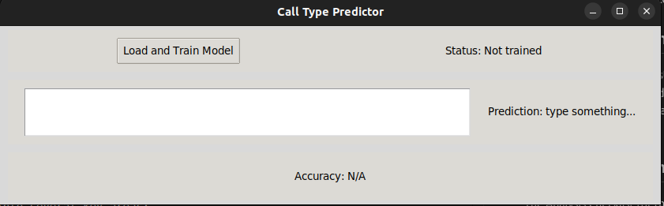
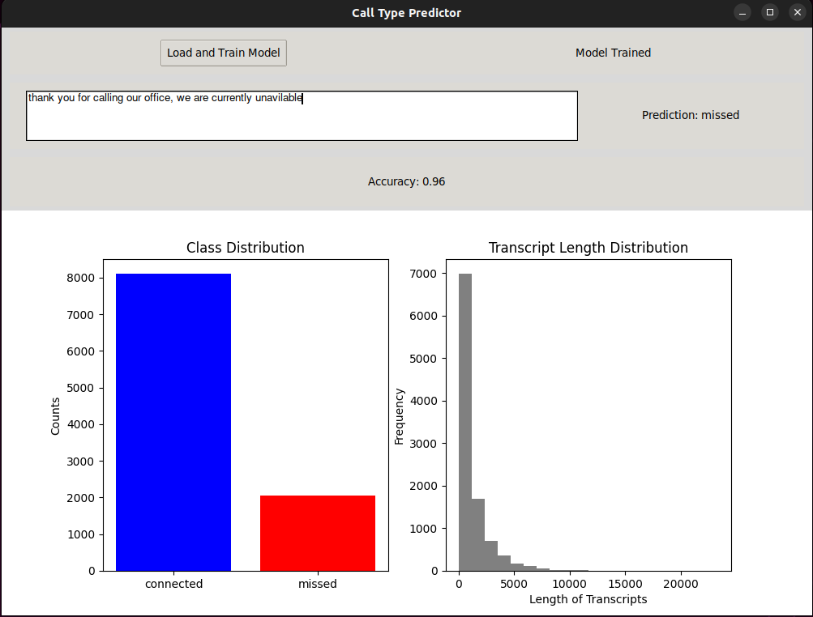

# Program Imges

## Initial screen

## Connected case screen

## Missed case screen

### Project Documentation Checklist

#### **A. Version Control (Git)**

- **Overview**: Utilize Git for version control, ensuring that every feature and bug fix is developed on separate branches. Regular commits will help in tracking changes and understanding the project's evolution.
- **Details**:
  - Initialize a Git repository.
  - Use feature branches to develop new functionalities.
  - Merge branches back to the main branch using pull requests to review code changes.
  - Use `git revert` or `git reset` to undo changes when necessary.
- **Link**: [Git Commands and Usage](./documents/Version_Control_GIT.md)

#### **B. UML Diagrams**

1. **Activity Diagram**: Illustrates the workflow of loading data, training the model, making predictions, and displaying results in the GUI. This diagram will show the dynamic process from start to finish.
2. **Class Diagram**: Describes the structure of the `CallTypePredictor` class along with its relationships with other components such as the GUI (`window`, `frame_train`, etc.), showcasing attributes and methods involved.
3. **Component Diagram**: Shows how different parts of your Python application (data preprocessing, training, prediction, GUI management) interact, highlighting dependencies between components.

- **Link**: [Requirements Management in Trello and Jira](./documents/UML_Diagrams_README.md)

#### **C. Requirements Engineering**

- **Overview**: Utilize tools like Trello for a simplified, agile approach to track and manage project requirements
- **Details**:
  - Trello can be used to manage simple lists of tasks and features, categorized by progress (To Do, In Progress, Done).
- **Link**: [Requirements Management in Trello](./documents/Requirements_Engineering_README.md)

#### **D. Analysis Checklist**

- **Overview**: Develop a checklist based on the analysis learning unit, which will be applied to evaluate the software architecture and coding standards of the project.
- **Details**:
  - Checklist items might include code review standards, performance benchmarks, security audits, and usability tests.
- **Link**: [Analysis Checklist Application](./documents/Analysis_Checklist_README.md)

#### **E. Domain-Driven Design (DDD)**

- **Overview**: Conduct a Domain-Driven Design session to define the bounded contexts and ubiquitous language for the project. Identify domains such as Data Preprocessing, Model Training, Prediction, and GUI Management.
- **Details**:
  - Use Event Storming to brainstorm and identify domain events, commands, and aggregates.
  - Map these domains in a Core Domain Chart and outline the interactions and dependencies.
- **Link**: [DDD Documentation](./documents/Domain_Driven_Design_README.md)

#### **F. Metrics**

- **Overview**: Integrate metrics such as code quality checks using SonarQube and performance metrics to monitor the efficiency of the machine learning model.
- **Details**:
  - Set up SonarQube to analyze code quality and maintainability.
  - Implement performance metrics to measure the model's prediction speed and accuracy.
- **Link**: [Integrated Metrics](./documents/Metrics_README.md)

#### **G. Clean Code Development**

- **Overview**: Implement clean code principles throughout the project to enhance readability, maintainability, and scalability.
- **Details**:
  - Examples include the use of meaningful names, small functions, and clear and concise comments.
  - Create a cheat sheet for clean code practices to be followed.
- **Link**: [Clean Code Practices and Cheat Sheet](./documents/Clean_Code_Development_README.md)

#### **H. Build Management**

- **Overview**: Establish a robust build management system using tools like Jenkins, Docker, and Gradle to automate the building, testing, and deployment processes. This enhances consistency, efficiency, and reliability across development, staging, and production environments.
- **Details**:
  - **CI/CD Pipelines**: Use Jenkins to automate continuous integration and continuous deployment processes.
  - **Docker**: Containerize applications to ensure consistency across environments.
  - **Gradle**: Manage dependencies, compile code, and generate build artifacts.
  - **Environments**: Maintain separate development, staging, and production environments.
  - **Documentation**: Generate build reports and deployment logs for transparency.
- **Link**: [Build Management and CI/CD Practices](./documents/Build_Management_README.md)

#### **I. Unit Testing**

- **Overview**: Integrate comprehensive unit tests to ensure that individual components function correctly independently.
- **Details**:
  - Use Python’s `unittest` framework to write tests for the model's methods and GUI interactions.
- **Link**: [Unit Tests Examples](./documents/Unit_Testing_README.md)

#### **J. IDE Usage and Functional Programming**

- **Overview**: Leverage an IDE like PyCharm or Visual Studio Code to develop the application, utilizing features such as code completion, debugging, and version control integration.
- **Details**:
  - Discuss favorite IDE shortcuts and features that enhanced productivity.
  - Implement functional programming concepts where possible, such as using immutable data structures and pure functions in Python.
- **Link**: [IDE Features and Functional Programming Techniques](./documents/Functional_Programming_README.md)
