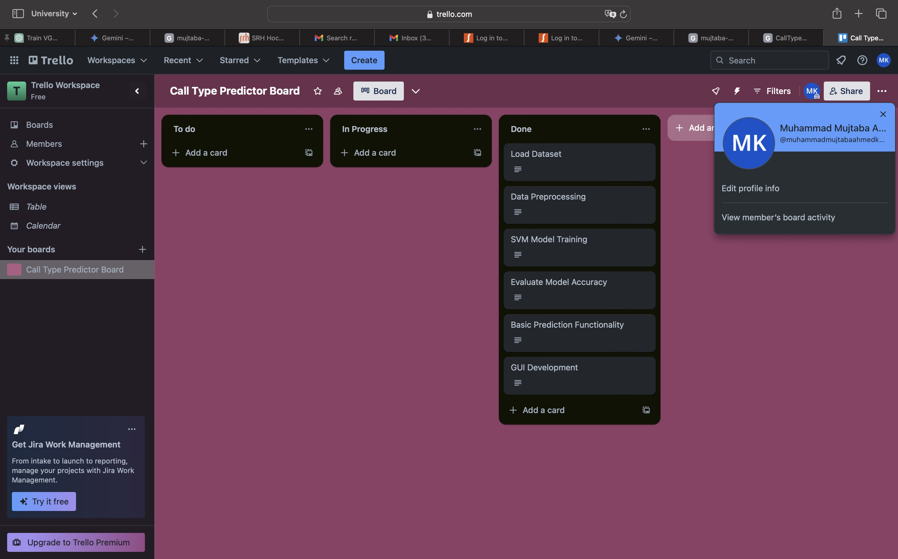

# Requirements Engineering with Trello

This document provides an overview of how Trello was used for managing the requirements for the Call Type Predictor project. It includes details about the setup of the Trello board, the categorization of tasks, and how these tasks were tracked and managed throughout the project lifecycle.

## Overview of Trello Board Setup

The Trello board for the Call Type Predictor project is designed to streamline the workflow and ensure all project requirements are met efficiently. The board is divided into several lists, representing different stages of task completion, from conception to completion.

## Trello Board Lists

1. **To Do**: Tasks that are identified and pending initiation.
2. **In Progress**: Tasks that are currently being worked on.
3. **Review**: Tasks awaiting review or approval.
4. **Done**: Tasks that have been completed.

## Using the Trello Board

Each task related to the project is represented as a card within these lists. Cards are moved from left to right as they progress through stages of completion. This visual representation helps track the progress of the project at a glance and ensures that all team members are aware of the task statuses.

## Final Trello Board Image

Below is an image of the final Trello board used for the project:

## Link to Trello Board

Visit the [Call Type Predictor Trello Board](https://trello.com/invite/b/4dBInp7Z/ATTI7c4cb40342488fcf2bb35c058cdbe76521940E9F/call-type-predictor-board) to view it directly and explore the detailed setup.

---