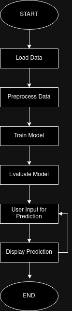

# UML Diagrams

This document provides links to the UML diagrams created for the Call Type Predictor project. Each diagram helps in understanding different aspects of the application's design and operation.

## Diagrams

### Activity Diagram

This diagram illustrates the sequence of actions from data loading to making predictions based on user input.

### Class Diagram

This diagram shows the classes, their attributes, operations, and the relationships among them, providing a static view of the system.

### Component Diagram

This diagram details the software components, their dependencies, and how they interact to form the complete system.

---

By exploring these diagrams, stakeholders can gain insights into the functional flow, structure, and architectural organization of the project.
